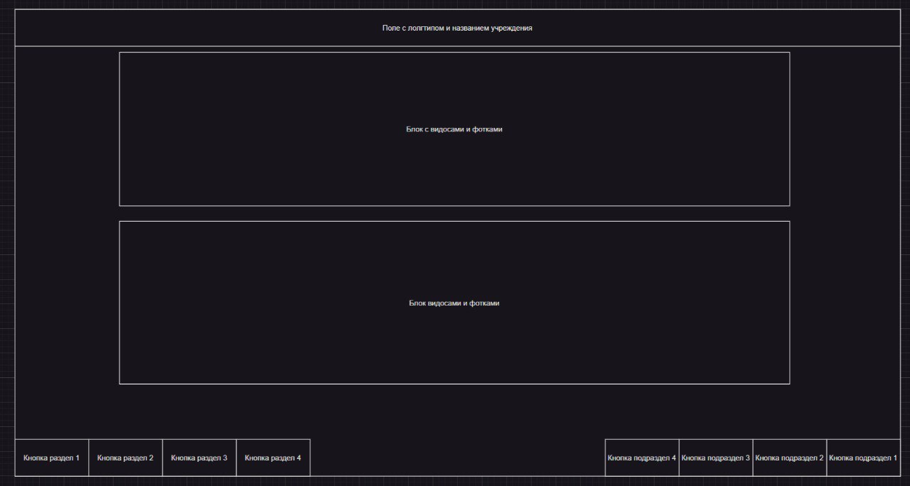

# Общее описание

Цель - софтовая ччасть программно-аппаратного комплекса класса "Информационный киоск"

Программа должна отображать информацию, хранимую на сервере. Информация разбита на категории и подкатегории. Количество категорий и подкатегорий - перменное, задается пользователем при заполнении/настройке инф системы.

## Категории

Категории записей могут быть трех видов:

1. Новость
2. Карточка сотрудника
3. Таблица с расписанием

Карточка сотрудника и новость отображаются в виде "карточки" ал-я материал дизайн. Различие только в количестве отображаемых карточек в ряд, новость - 1 карточка в ряду, карточка сотрудника - 3-4(надо смотреть как будет выглядеть)

### Новость

Новость включает в себя

1. Одну или несколько картинок
2. может содержать видео
3. текстовая часть новости

 Картинки и видео при нажатии открываются крупно, видео при запуске простотра проигрывается со звуком

### Карточка сотрудника

Состоит из 3-х блоков

1. фото
2. Краткая информация(ФИО, должность)
3. Развернутая информация(не более абзаца, опционально)

### Расписание

Каждая отдельная запись расписания содержит расписание уроков на 1 день для **одного класса. Поля и пример строчки**:
|время|предмет|ФИО учителя|кабинет|
|-----|-------|-----------|-------|
|12:00-12:40|Математика|Иванова А.А|404|

## Данные
Данные передаются ответом на *POST*-запрос в виде json. Картинки и видео - ссылками.

# Внешний вид

## Примеры

Карточка сотрудника

Росписание

Новостной раздел

Так же должна быть возможность переключить располоджение кнопок для маломобильных пользователей(в настройках приложения???)

## Настройки внешнего вида

Верхняя плашка - название учереждения и логотип(задается через прилоджение для администрирования)

Цветовая гамма оформления - Цвет верхней плашки, цвет фона и текста задается в приложении для администрирования

Возможность выбрать шрифт из набора предустановленных
